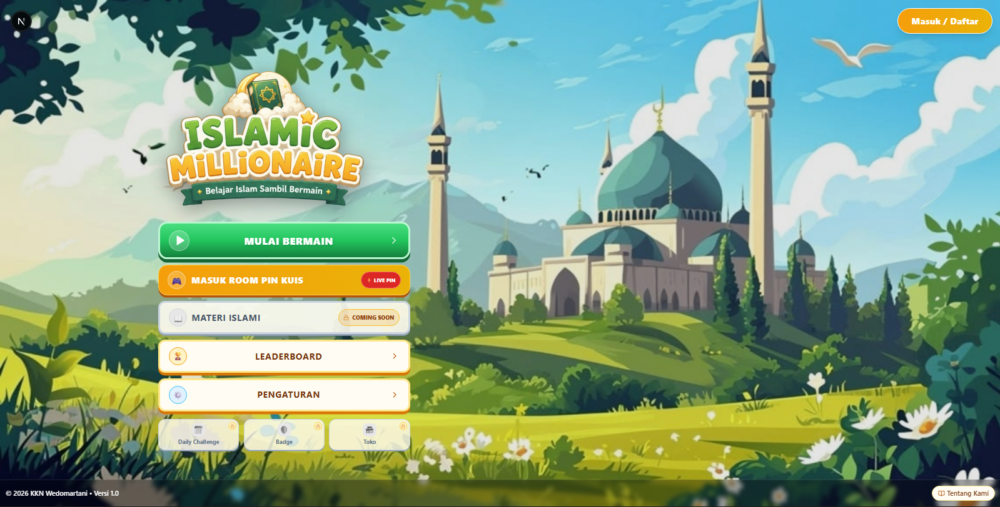

# 🕌 Islamic Quiz Games WebApp

<div align="center">

  
  
  
  
  

  <h3>✨ Platform Web App Interactive Quiz Edukasi Islami KKN Wedomartani ✨</h3>

  <p align="center">
    Aplikasi Web Kuis Edukatif Islami Modern dengan Mode <b>Who Wants to Be a Millionaire</b> (Solo) & <b>Quroom Live Realtime</b> (Multiplayer Event/Sosialisasi).
  </p>

  <br />
  

</div>

---

## 🌟 Fitur Utama (Key Features)

### 🏆 1. Mode Classic Millionaire (Solo Player)
- 🪜 **15 Tingkat Tangga Hadiah & Poin**: Dari level 1 (100 Poin) hingga Puncak Rp 1 Miliar Poin.
- 💡 **3 Lifeline Bantuan Interaktif**:
  - `50:50` — Menghilangkan 2 pilihan jawaban salah secara acak.
  - `Tanya Ustadz` — Petunjuk khusus dari ustadz sesuai pembahasan soal.
  - `Pilihan Jemaah` — Persentase suara jemaah secara statistik.
- 📖 **Dalil & Penjelasan Edukatif**: Setiap selesai menjawab, tampil dalil Al-Qur'an/Hadits & penjelasan edukatif Islami.
- 🎵 **Audio & Sound Effects**: Suara latar khas Millionaire, efek jawaban benar/salah, serta ketegangan timer.

---

### 🎮 2. Mode Quroom Live Room (Multiplayer / Event Sosialisasi)
- 📍 **Kode PIN Room 6-Digit**: Host/Operator membuat room kuis live dari Admin Panel.
- 📺 **Proyektor / Display View**: Tampilan layar utama untuk proyektor acara sosialisasi KKN dengan timer visual & peringkat live.
- 📱 **Pemain / Participant View**: Peserta dapat bergabung dengan PIN Room menggunakan HP masing-masing secara realtime.
- ⚡ **Supabase Realtime Engine**: Sinkronisasi status room, pertanyaan, jawaban pemain, dan papan peringkat secara langsung tanpa refresh.

---

### 👤 3. Sistem Profil & Kustomisasi Player
- 🎖️ **Level, XP & Poin Amal**: Akumulasi poin dari setiap kuis yang dimainkan.
- 🖼️ **Kustomisasi Profil**:
  - Avatar Islami (Pilihan karakter laki-laki/perempuan).
  - Bingkai Foto Profil (Border Frame Gold, Emerald, Diamond).
  - Background Profil Keren.
  - Bio & Kuotasi Islami (QS. Taha: 114).
- 🏷️ **Title Tag**: Gelar kehormatan (misal: *Muslim Cerdas*, *Penuntut Ilmu*).

---

### 📚 4. Admin Panel & Bank Soal Cerdas
- ➕ **CRUD Soal Lengkap**: Tambah, Edit, Hapus, dan Filter Soal berdasarkan kategori & mode permainan.
- 📋 **Universal CSV / Excel Import**: Impor puluhan soal sekaligus dari Google Sheets / Excel atau fitur copas teks tabel.
- 🔄 **Auto-Sync & Seed Supabase**: Tombol 1-klik untuk menyinkronkan 15 soal bawaan awal ke database Supabase.
- 🏷️ **10+ Kategori Islami**: Rukun Islam, Shalat, Al-Qur'an, Nabi & Rasul, Aqidah, Doa Harian, Ramadhan, Akhlak, Adab, Kehidupan Sehari-hari.

---

### 🏆 5. Leaderboard & Cetak Sertifikat
- 🥇 **Papan Peringkat Global**: Peringkat pemain terbaik berdasarkan skor tertinggi dan kecepatan durasi.
- 📜 **Digital Certificate Generator**: Pemain yang menyelesaikan kuis dapat mengunduh sertifikat digital apresiasi.

---

## 🛠️ Teknologi yang Digunakan (Tech Stack)

- **Frontend Framework**: [Next.js 15](https://nextjs.org/) (App Router & Pages API)
- **Language**: [TypeScript](https://www.typescriptlang.org/)
- **Styling**: [Tailwind CSS](https://tailwindcss.com/) dengan Animasi [Framer Motion](https://www.framer.com/motion/) & Glassmorphism Aesthetics
- **Backend & Database**: [Supabase](https://supabase.com/) (PostgreSQL, Row Level Security, & Realtime Subscriptions)
- **Icons**: [Lucide React](https://lucide.dev/)
- **Audio Engine**: Web Audio API / Native Audio Player

---

## 🚀 Panduan Memulai (Quick Start)

### 1. Prasyarat System
- **Node.js**: v18.0.0 atau versi lebih baru
- **npm** atau **yarn**
- Akun **Supabase** (Proyek PostgreSQL)

### 2. Kloning Repositori
```bash
git clone https://github.com/raihanfadhlurrahman/quizgames-webapp.git
cd minigames-webapp
```

### 3. Install Dependensi
```bash
npm install
```

### 4. Konfigurasi Environment Variable (`.env.local`)
Buat file `.env.local` di folder root project dan masukkan credentials Supabase Anda:
```env
NEXT_PUBLIC_SUPABASE_URL=https://<your-supabase-project-id>.supabase.co
NEXT_PUBLIC_SUPABASE_ANON_KEY=your-supabase-anon-key
```

### 5. Jalankan Server Dev
```bash
npm run dev
```
Buka browser di `http://localhost:3000`.

---

## 🗄️ Inisialisasi Database Supabase

1. Buka **Supabase Dashboard** -> **SQL Editor**.
2. Jalankan skrip tabel dari file **[`dokumen/schema.sql`](./dokumen/schema.sql)**.
3. Jalankan kebijakan Row Level Security (RLS) dari file **[`dokumen/fix_questions_rls.sql`](./dokumen/fix_questions_rls.sql)**:
   ```sql
   ALTER TABLE public.questions ENABLE ROW LEVEL SECURITY;
   CREATE POLICY "Allow all access to questions" ON public.questions FOR ALL USING (true) WITH CHECK (true);
   ```
4. Masuk ke halaman **Admin Panel** (`http://localhost:3000/admin`), lalu tekan tombol **`Sync 15 Soal ke Supabase`** untuk me-load soal dasar ke database.

---

## 📁 Struktur Folder Project

```text
minigames-webapp/
├── dokumen/                # Dokumentasi skema SQL, RLS, & template CSV
├── public/                 # Aset gambar border, avatar, background, & audio
├── scratch/                # Script pengujian internal
├── src/
│   ├── app/                # Page Routing Next.js (Home, Admin Panel)
│   ├── components/         # Komponen UI (QuizArena, KahootPlayer, RoomHost, dll)
│   ├── data/               # Data awal seed (Categories & Questions)
│   ├── lib/                # Layanan Supabase (gameService, roomService, authService)
│   ├── pages/api/          # API Handlers Next.js
│   └── types/              # TypeScript Types Definition
├── .env.local.example      # Contoh file environment
└── README.md
```

---

## 👥 Tim Penyusun & Lisensi

Dibuat dengan ❤️ untuk Program Kerja **KKN Wedomartani**.

Distributed under the **MIT License**. See `LICENSE` for more information.
