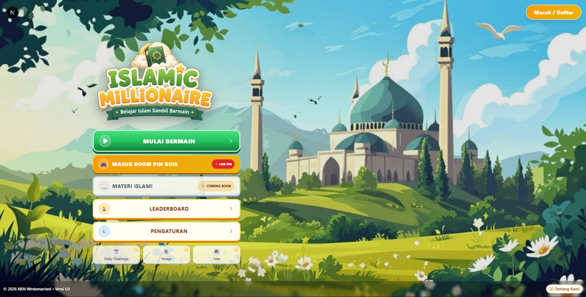
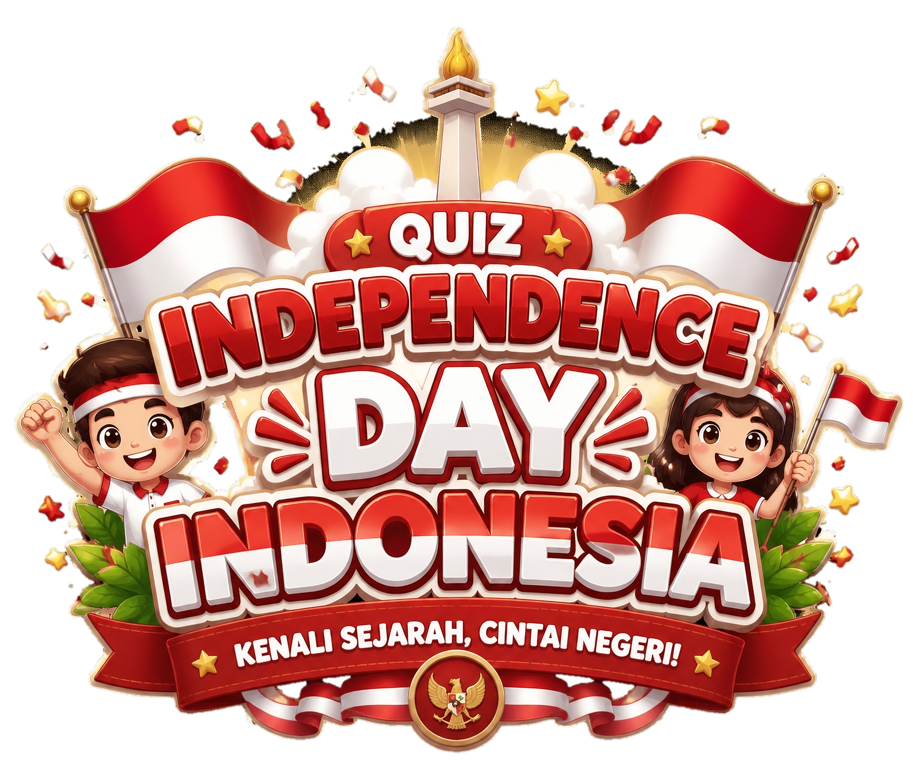
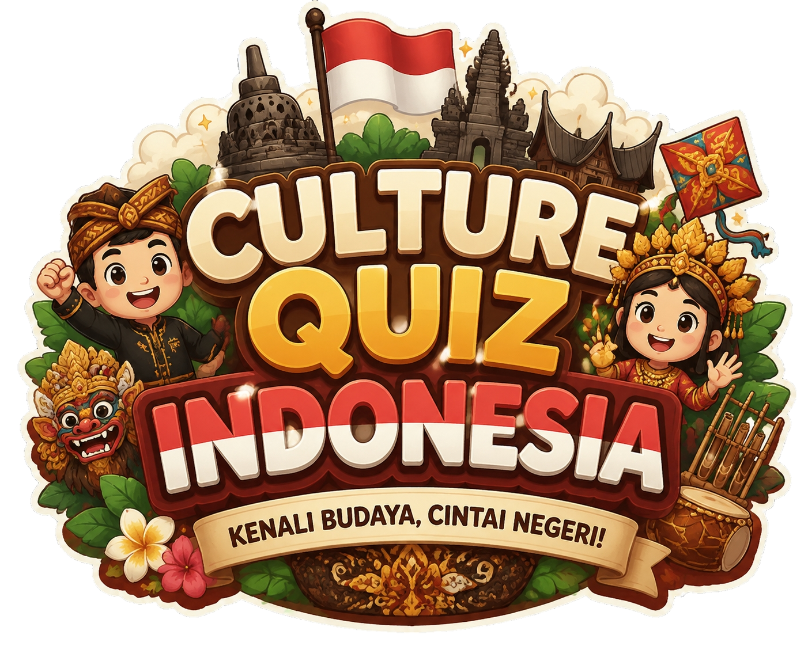
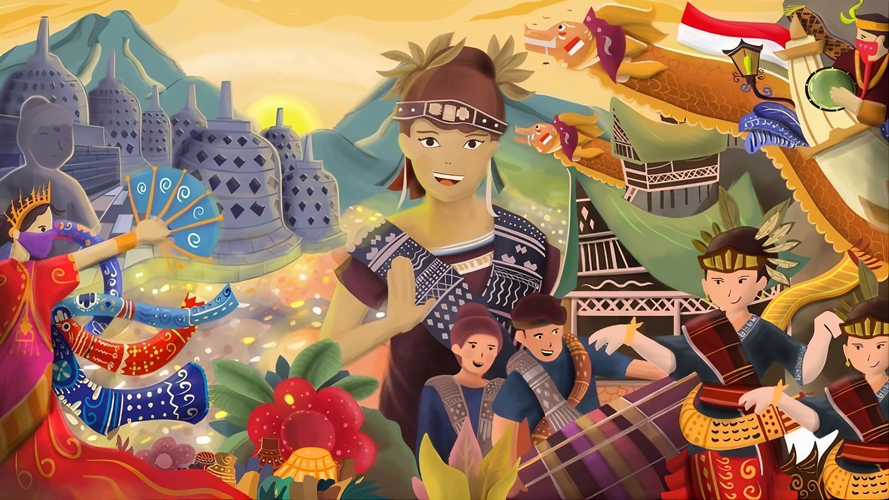

# 🕌 🇲🇨 🎭 Interactive Multi-Theme Quiz WebApp

<div align="center">

  
  
  
  
  

  <h3>✨ Platform Web App Kuis Interaktif Edukatif 3-in-1 (Islami, Kemerdekaan, Kebudayaan) ✨</h3>

  <p align="center">
    Aplikasi Web Kuis Edukatif Modern dengan Mode <b>Solo Player (Millionaire Ladder)</b> & <b>Multiplayer Event Live (Quroom Realtime)</b>.<br/>
    Dilengkapi sistem <b>3 Multi-Tema Dinamis</b>, Manajemen Bank Soal CSV, Profil Player, Leaderboard, & Sertifikat Digital.
  </p>

  <br />
  

</div>

---

## 🎨 Preview & 3 Tema Utama (Multi-Theme System)

Aplikasi ini memiliki **3 Tema Visual & Konten Khusus** yang dapat berganti secara otomatis sesuai kategori soal atau dipilih secara manual oleh pengguna:

| Tema | Branding & Logo | Background Utama | Lifeline Bantuan Khusus | Jenis Sertifikat Digital |
| :---: | :---: | :---: | :---: | :---: |
| **🕌 1. Islami** |  |  | **Bantuan Ustadz 👳**<br/> | Sertifikat Keagamaan Islami |
| **🇲🇨 2. Kemerdekaan** |  |  | **Petunjuk Pejuang 🎖️**<br/> | Sertifikat Wawasan Kebangsaan |
| **🎭 3. Kebudayaan** |  |  | **Petunjuk Budayawan 🎭**<br/> | Sertifikat Duta Budaya Nusantara |

---

## 🌟 Fitur Utama Lengkap (Key Features)

### 🏆 1. Mode Solo Player (Classic Millionaire Quiz)
- 🪜 **15 Level Tangga Poin**: Dari level 1 (100 Poin) hingga puncak 1 Miliar Poin.
- 💡 **3 Lifeline Bantuan Interaktif**:
  - `50:50` — Menghilangkan 2 opsi jawaban salah secara acak.
  - `Tanya Ustadz / Pejuang / Budayawan` — Petunjuk khusus yang relevan dengan soal & tema aktif.
  - `Pilihan Jemaah / Warga` — Persentase statistik suara publik.
- 📖 **Dalil & Rujukan Edukatif**: Tampilan modal popup otomatis seusai menjawab yang berisi dalil Al-Qur'an/Hadits, Catatan Sejarah, atau Ensiklopedia Budaya.
- 🎵 **Audio & Sound Effects Engine**: Efek suara ketegangan timer, jawaban benar/salah, serta musik latar Millionaire.

---

### 🎮 2. Mode Quroom Multiplayer Realtime (Event Sosialisasi / KKN)
- 📍 **PIN Room 6-Digit**: Host/Operator membuat room kuis live dari Admin Panel.
- 📺 **Proyektor / Display View**: Tampilan layar proyektor untuk acara sosialisasi KKN dengan timer visual, papan peringkat live, & break-down persentase jawaban.
- 📱 **Participant Mobile View**: Peserta bergabung dengan PIN Room melalui HP masing-masing secara realtime.
- ⚡ **Supabase Realtime Engine**: Sinkronisasi status room, soal, timer, dan skor pemain tanpa perlu refresh halaman.

---

### 👤 3. Sistem Profil & Kustomisasi Player
- 🎖️ **Level, XP & Poin Akumulasi**: Poin tersimpan secara otomatis di database.
- 🖼️ **Kustomisasi Profil**:
  - Pilihan Avatar Karakter (Laki-laki / Perempuan).
  - Bingkai Foto Profil (Border Frame Gold, Emerald, Diamond, Classic).
  - Background Kartu Profil Keren.
- 🏷️ **Gelar & Title Tag**: Gelar kehormatan sesuai akumulasi poin (misal: *Muslim Cerdas*, *Pejuang Bangsa*, *Duta Budaya*).

---

### 📚 4. Admin Panel & Bank Soal Cerdas
- ➕ **CRUD Soal Lengkap**: Tambah, Edit, Hapus, dan Filter soal berdasarkan kategori & tema (`islamic`, `independence`, `culture`).
- 📋 **Impor / Ekspor CSV**: Impor puluhan soal sekaligus dari file Excel/CSV atau buat template soal melalui [`public/template_soal.csv`](public/template_soal.csv).
- 🔄 **Auto-Sync 1-Klik**: Sinkronisasi awal 15 soal default bawaan ke database Supabase.
- 📺 **Manajemen Room Live**: Kontrol jalannya permainan multiplayer (Mulai Kuis, Lanjut Soal, Akhiri Kuis).

---

### 📜 5. Leaderboard Global & Generator Sertifikat Digital
- 🥇 **Papan Peringkat Global**: Menampilkan jajaran pemain terbaik berdasarkan akumulasi skor.
- 🎓 **Cetak Sertifikat Digital**: Generator sertifikat otomatis sesuai tema kuis yang dimainkan lengkap dengan Nama Pemain, Skor Akhir, Tanggal, dan Cap Stempel Digital.

---

## 🛠️ Teknologi yang Digunakan (Tech Stack)

- **Frontend Framework**: [Next.js 15](https://nextjs.org/) (App Router & Pages API)
- **Language**: [TypeScript](https://www.typescriptlang.org/)
- **Styling**: [Tailwind CSS](https://tailwindcss.com/) dengan Glassmorphism Aesthetics & Micro-Animations
- **Backend & Database**: [Supabase](https://supabase.com/) (PostgreSQL, Row Level Security, & Realtime WebSockets)
- **Icons & UI**: [Lucide React](https://lucide.dev/) & [Canvas Confetti](https://www.npmjs.com/package/canvas-confetti)
- **Audio Engine**: Native HTML5 Web Audio Engine

---

## 🚀 Panduan Memulai (Quick Start)

### 1. Prasyarat System
- **Node.js**: v18.0.0 atau versi lebih baru
- **npm** atau **yarn**
- Akun **Supabase** (Proyek PostgreSQL)

### 2. Kloning Repositori & Install Dependensi
```bash
git clone https://github.com/raihanfadhlurrahman/quizgames-webapp.git
cd minigames-webapp
npm install
```

### 3. Konfigurasi Environment Variable (`.env.local`)
Buat file `.env.local` di root folder project:
```env
NEXT_PUBLIC_SUPABASE_URL=https://<your-supabase-project-id>.supabase.co
NEXT_PUBLIC_SUPABASE_ANON_KEY=your-supabase-anon-key
SUPABASE_SERVICE_ROLE_KEY=your-supabase-service-role-key
```

### 4. Jalankan Server Development
```bash
npm run dev
```
Aplikasi dapat diakses di `http://localhost:3000`.

---

## 🗄️ Inisialisasi Database Supabase

1. Buka **Supabase Dashboard** -> **SQL Editor**.
2. Jalankan skrip DDL dari file **[`dokumen/schema.sql`](./dokumen/schema.sql)**.
3. Jalankan kebijakan Row Level Security (RLS) dari file **[`dokumen/fix_questions_rls.sql`](./dokumen/fix_questions_rls.sql)**.
4. Masuk ke halaman Admin Panel (`http://localhost:3000/admin`), lalu tekan tombol **`Sync 15 Soal ke Supabase`** untuk me-load bank soal awal ke database.

---

## 📁 Struktur Folder Project

```text
minigames-webapp/
├── dokumen/                # Buku panduan admin, schema SQL, RLS script
├── public/                 # Assets gambar static (border, avatar, logo 3 tema, template_soal.csv)
├── src/
│   ├── app/                # Next.js App Router (Home /, Admin /admin)
│   ├── components/         # Komponen UI (QuizArena, KahootPlayerArena, RoomHostView, ThemeSelectModal, dll)
│   ├── data/               # Data rujukan static (avatars, borders, bgprofile, seedQuestions)
│   ├── lib/                # Core Services (gameService, roomService, themeConfig, audioManager)
│   ├── pages/api/          # API Route Next.js Backend
│   └── types/              # TypeScript Types Definition
├── .env.local              # Credential Supabase (local dev)
├── .env.local.example      # Template konfigurasi environment
├── next.config.js          # Konfigurasi Next.js
├── tailwind.config.js      # Konfigurasi Styling Tailwind
├── tsconfig.json           # Konfigurasi TypeScript
└── README.md               # Dokumentasi utama project
```

---

## 👥 Tim Penyusun & Lisensi

Dibuat dengan ❤️ untuk Program Kerja **KKN Wedomartani**.

Distributed under the **MIT License**.
