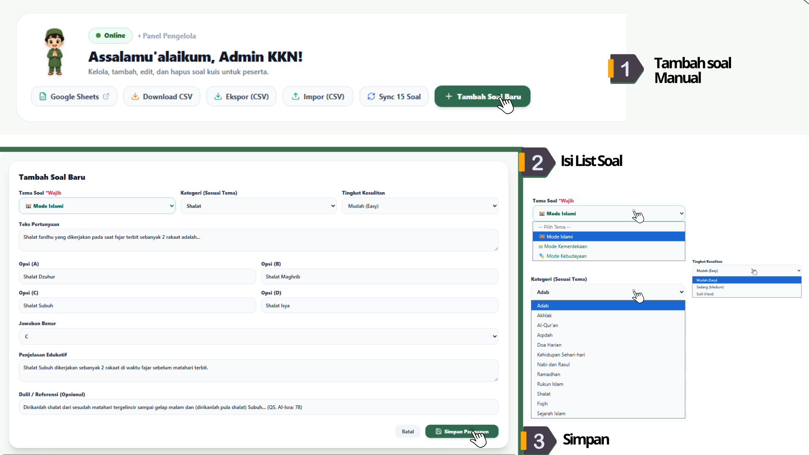
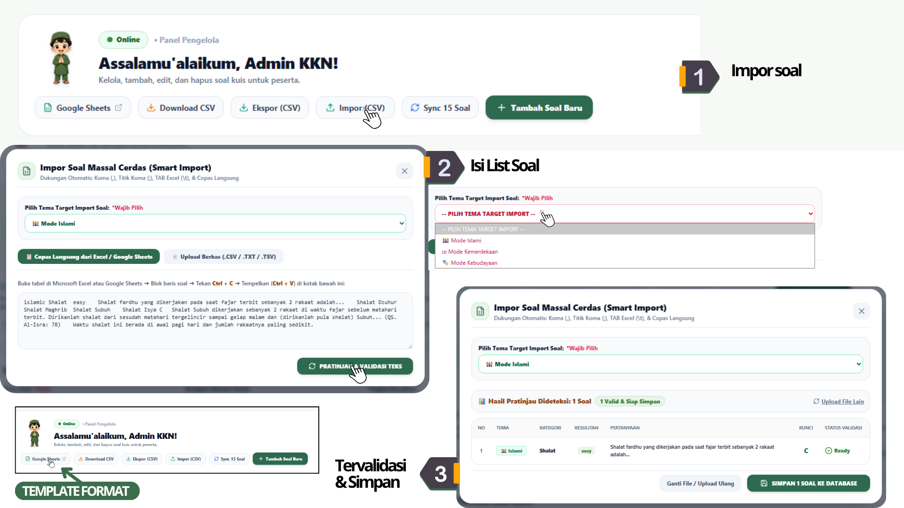
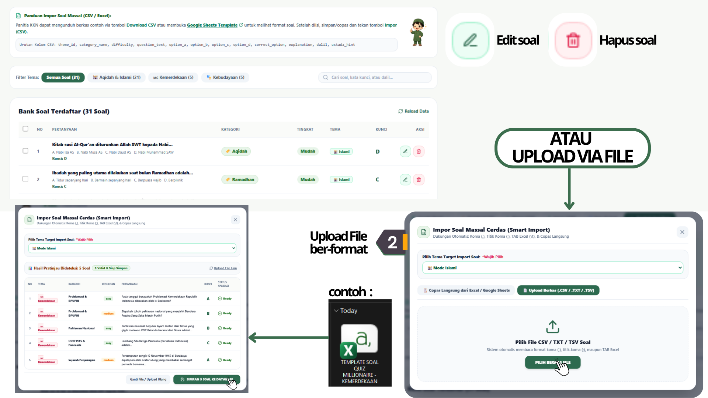
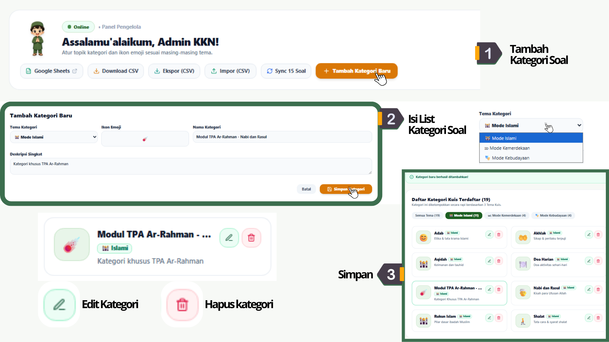
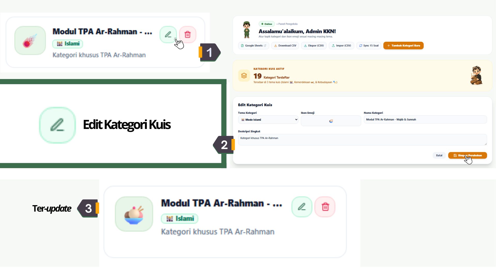
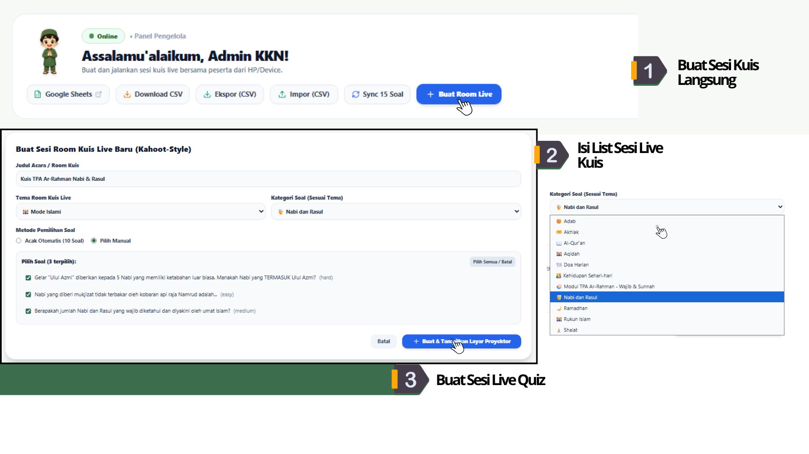
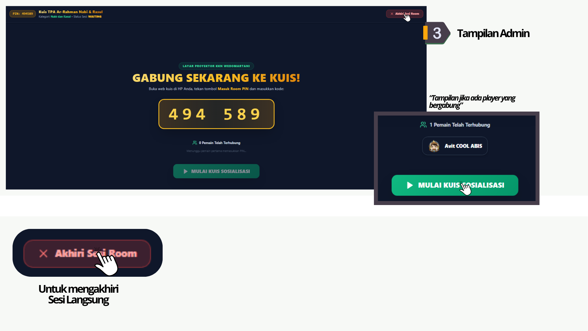
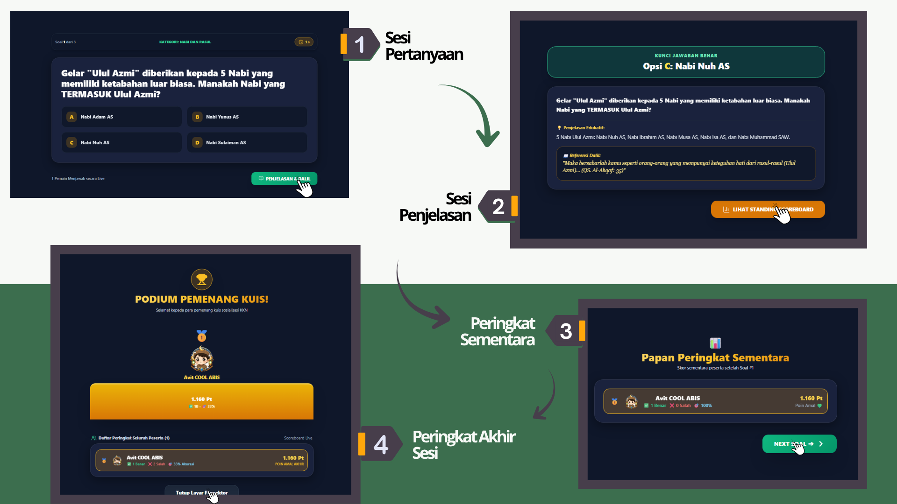

# 📖 BUKU PANDUAN PENGGUNAAN PANEL ADMIN KKN
### Sistem Pengelolaan Kuis Edukasi Wedomartani (Islami, Kemerdekaan, & Kebudayaan)

---

## 📑 DAFTAR ISI

1. [BAB 1: Pendahuluan & Akses Administrator](#bab-1-pendahuluan--akses-administrator)
   - 1.1 Maksud dan Tujuan Buku Panduan
   - 1.2 Cara Masuk Sesi (*Login Admin*)
   - 1.3 Perangkat & Responsivitas (Laptop & Smartphone/HP)
2. [BAB 2: Antarmuka Dashboard Admin](#bab-2-antarmuka-dashboard-admin)
   - 2.1 Menu Navigasi Utama (Sidebar)
   - 2.2 Ringkasan Kartu KPI Statistik
   - 2.3 Baris Aksi Cepat (*Quick Action Bar*)
3. [BAB 3: Modul Bank Soal Kuis](#bab-3-modul-bank-soal-kuis)
   - 3.1 Langkah Menambah Soal Manual (Formulir)
   - 3.2 Panduan Impor Massal dari Excel / Google Sheets (Copas)
   - 3.3 Impor Berkas File (.CSV / .TXT / .TSV) & Format Kolom
   - 3.4 Filter Tema, Pencarian, & Edit/Hapus Soal
4. [BAB 4: Modul Pengelolaan Kategori](#bab-4-modul-pengelolaan-kategori)
   - 4.1 Langkah Menambahkan Kategori Baru
   - 4.2 Penataan Emoji Ikon & Deskripsi Topik
   - 4.3 Cara Mengedit & Memperbarui Kategori
5. [BAB 5: Modul Sesi Room Live & Layar Proyektor](#bab-5-modul-sesi-room-live--layar-proyektor)
   - 5.1 Konsep Pertandingan Live Proyektor
   - 5.2 Langkah Membuat Room Live Baru & PIN 6-Digit
   - 5.3 Menayangkan Layar Proyektor (Host View & Ruang Tunggu)
   - 5.4 Alur Jalannya Pertandingan (Pertanyaan, Penjelasan, & Leaderboard)
   - 5.5 Peringkat Akhir Sesi & Selebrasi Pemenang
6. [BAB 6: Modul Pemain & Rekapitulasi Skor](#bab-6-modul-pemain--rekapitulasi-skor)
   - 6.1 Daftar Akun Peserta Terdaftar
   - 6.2 Pemantauan Perolehan Poin Amal, Wawasan, & Budaya
   - 6.3 Pencarian Peserta
7. [BAB 7: Troubleshooting & Penanganan Kendala Teknis](#bab-7-troubleshooting--penanganan-kendala-teknis)

---

## BAB 1: Pendahuluan & Akses Administrator

### 1.1 Maksud dan Tujuan Buku Panduan
Buku Panduan ini disusun sebagai pedoman operasional lengkap bagi Panitia KKN Wedomartani, Pengajar/Guru, maupun Host Acara Kuis dalam mengelola seluruh konten kuis interaktif. Melalui Panel Admin ini, pengelola dapat menambahkan soal, mengatur kategori, melangsungkan pertandingan kuis live berbasis proyektor, hingga memantau statistik poin para peserta.

### 1.2 Cara Masuk Sesi (*Login Admin*)
1. Buka peramban (*browser*) web dan kunjungi alamat aplikasi admin:
   `http://localhost:3000/admin` (atau URL domain resmi aplikasi KKN).
2. Pada layar **Sesi Masuk Admin KKN**:
   - **Username**: `admin`
   - **Password**: `ceritawedomartani`
3. Klik tombol **MASUK PANEL ADMIN**.
4. Apabila kredensial benar, Anda akan langsung diarahkan ke Dashboard Pengelola.

### 1.3 Perangkat & Responsivitas (Laptop & Smartphone/HP)
- **Komputer / Laptop**: Direkomendasikan untuk pengelolaan konten massal (seperti impor CSV/Excel) dan mengoperasikan **Layar Proyektor Host View**.
- **Smartphone / HP / Tablet**: Panel Admin telah dilengkapi **Mobile Drawer Menu (`[ ☰ Menu ]`)** sehingga pengelola tetap dapat memantau atau menambah soal secara fleksibel dari smartphone.

---

## BAB 2: Antarmuka Dashboard Admin

### 2.1 Menu Navigasi Utama (Sidebar)
Terletak pada sisi kiri halaman (atau diakses via tombol `[ ☰ Menu ]` pada HP):
- 📚 **Bank Soal Kuis**: Tempat mengelola seluruh daftar soal.
- 🏷️ **Kelola Kategori**: Tempat mengatur topik kuis dan emoji ikon per tema.
- 🎮 **Sesi Room Live**: Tempat menerbitkan PIN pertandingan dan membuka Layar Proyektor Host.
- 👥 **Pemain & Skor**: Tempat melihat rekapitulasi poin seluruh peserta terdaftar.
- 📖 **Panduan Panel Admin**: Bantuan interaktif bertahap kapan saja.

### 2.2 Ringkasan Kartu KPI Statistik
Menampilkan rangkuman realtime statistik di bagian atas dashboard:
1. **Total Soal**: Jumlah keseluruhan soal aktif beserta rincian tema (🕌 Islami, 🇲🇨 Kemerdekaan, 🎭 Kebudayaan).
2. **Kategori**: Jumlah topik kategori yang terdaftar di sistem.
3. **Sesi Room Live**: Jumlah sesi room live yang pernah dibuat (Status Aktif vs Selesai).
4. **Pemain Terdaftar**: Jumlah total akun peserta yang terhubung dengan statistik leaderboard.

### 2.3 Baris Aksi Cepat (*Quick Action Bar*)
- **Google Sheets**: Membuka berkas template soal resmi di Google Sheets.
- **Download CSV**: Mengunduh berkas template `.csv` kosong ke perangkat.
- **Ekspor (CSV)**: Mengunduh data soal yang ada di database ke file CSV.
- **Impor (CSV)**: Membuka modal impor massal soal cepat.
- **Sync 15 Soal**: Sinkronisasi ulang 15 soal bawaan awal ke database.
- **+ Action Button**: Tombol kontekstual sesuai tab aktif (`+ Tambah Soal Baru`, `+ Tambah Kategori Baru`, atau `+ Buat Room Live`).

---

## BAB 3: Modul Bank Soal Kuis

### 3.1 Langkah Menambah Soal Manual (Formulir)

1. Pastikan Anda berada di tab **📚 Bank Soal Kuis**.
2. Klik tombol **`+ Tambah Soal Baru`** di pojok kanan atas *(Langkah 1)*.
3. Isikan formulir **Tambah Soal Baru** *(Langkah 2)*:
   - **Tema Soal (Wajib)**: Pilih salah satu dari *Mode Islami 🕌*, *Mode Kemerdekaan 🇲🇨*, atau *Mode Kebudayaan 🎭*.
   - **Kategori (Sesuai Tema)**: Pilih topik kategori yang sesuai (misal: *Adab*, *Aqidah*, *Shalat*, *Al-Qur'an*, dll).
   - **Tingkat Kesulitan**: Pilih *Mudah (Easy)*, *Sedang (Medium)*, atau *Sulit (Hard)*.
   - **Teks Pertanyaan**: Ketikkan kalimat pertanyaan kuis secara jelas.
   - **Pilihan Jawaban**: Isi Pilihan (A), Pilihan (B), Pilihan (C), dan Pilihan (D).
   - **Jawaban Benar**: Tentukan opsi kunci jawaban benar (A / B / C / D).
   - **Penjelasan Edukatif**: Tuliskan penjelasan ringkas pembahasan jawaban.
   - **Dalil / Referensi (Opsional)**: Masukkan teks dalil, surat/ayat Al-Qur'an, hadits, atau referensi pendukung.
4. Klik **`SIMPAN PERMANEN`** untuk menyimpan soal ke database *(Langkah 3)*.

---

### 3.2 Panduan Impor Massal dari Excel / Google Sheets (Copas)

Untuk memasukkan puluhan hingga ratusan soal sekaligus tanpa mengetik satu per satu:
1. Klik tombol **`Impor (CSV)`** pada baris aksi cepat *(Langkah 1)*. Anda juga dapat menekan link **`Google Sheets`** untuk membuka template resmi.
2. Pada modal Impor Cerdas:
   - Select **Pilih Tema Target Import Soal (Wajib Pilih)** (misal: *Mode Islami*).
   - Masuk ke tab **`Copas Langsung dari Excel / Google Sheets`** *(Langkah 2)*.
   - Buka berkas Excel/Google Sheets Anda ➔ Blok baris tabel soal ➔ Tekan **Ctrl + C**.
   - Tempelkan (**Ctrl + V**) ke dalam area teks modal impor.
   - Klik **`PRATINJAU & VALIDASI TEKS`**.
3. Periksa tabel **Hasil Pratinjau Dideteksi** *(Langkah 3)*:
   - Jika status menunjukkan **Ready**, klik **`SIMPAN X SOAL KE DATABASE`**.

---

### 3.3 Impor Berkas File (.CSV / .TXT / .TSV) & Format Kolom

Selain metode copas, Anda dapat langsung mengunggah file dokumen `.csv`, `.txt`, atau `.tsv`:
1. Pada modal Impor Soal Massal, pilih tab **`Upload Berkas (.CSV / .TXT / .TSV)`**.
2. Klik tombol **`PILIH BERKAS FILE`** ➔ Pilih file dari komputer Anda *(Langkah 2)*.
3. Urutan 12 kolom CSV wajib disusun sebagai berikut:
   `theme_id, category_name, difficulty, question_text, option_a, option_b, option_c, option_d, correct_option, explanation, dalil, ustadz_hint`

*Contoh Baris Data CSV:*
`islamic,Rukun Islam,easy,Berapakah jumlah Rukun Islam?,4 perkara,5 perkara,6 perkara,7 perkara,B,Rukun Islam ada 5 perkara,HR. Bukhari,Syahadat`

4. Setelah terverifikasi, klik **`SIMPAN X SOAL KE DATABASE`**.

---

### 3.4 Filter Tema, Pencarian, & Edit/Hapus Soal
- **Filter Tema**: Gunakan pill filter (*Semua Soal*, *Aqidah & Islami*, *Kemerdekaan*, *Kebudayaan*) untuk memilah daftar soal.
- **Kolom Pencarian**: Ketikkan kata kunci pertanyaan pada kotak pencarian di kanan.
- **Edit Soal**: Klik ikon pensil hijau (✏️) pada baris soal ➔ Perbarui data ➔ Klik **`SIMPAN PERUBAHAN`**.
- **Hapus Soal**: Klik ikon tong sampah merah (🗑️) pada baris soal ➔ Konfirmasi penghapusan.

---

## BAB 4: Modul Pengelolaan Kategori

### 4.1 Langkah Menambahkan Kategori Baru

1. Pindah ke tab **🏷️ Kelola Kategori** pada menu navigasi kiri.
2. Klik tombol **`+ Tambah Kategori Baru`** *(Langkah 1)*.
3. Lengkapi formulir **Tambah Kategori Baru** *(Langkah 2)*:
   - **Tema Kategori**: Tentukan tema utama (*Mode Islami*, *Mode Kemerdekaan*, atau *Mode Kebudayaan*).
   - **Nama Kategori**: Masukkan nama topik (misal: *Modul TPA Ar-Rahman - Nabi dan Rasul*, *Fiqih Ibadah*, *Kuliner Nusantara*).
   - **Ikon Emoji**: Pilih emoji pengenal visual (misal: 🕌, 🇮🇩, 🎭, ☄️, 🍧, 📜, 🏆, 🍜).
   - **Deskripsi Singkat**: Tuliskan penjelasan singkat isi kategori.
4. Klik **`SIMPAN KATEGORI`** *(Langkah 3)*. Kategori baru akan otomatis muncul di **Daftar Kategori Kuis Terdaftar**.

---

### 4.2 Penataan Emoji Ikon & Deskripsi Topik
Ikon emoji dan deskripsi yang Anda atur akan langsung dipublikasikan ke beranda utama permainan peserta, memudahkan peserta kuis dalam memilih topik yang diminati.

---

### 4.3 Cara Mengedit & Memperbarui Kategori

1. Pada kartu kategori yang ingin diubah, klik tombol ikon pensil hijau (✏️) **Edit Kategori** *(Langkah 1)*.
2. Form **Edit Kategori Kuis** akan terbuka *(Langkah 2)*. Anda dapat memperbarui Tema Kategori, Ikon Emoji, Nama Kategori, maupun Deskripsi Singkat.
3. Klik **`SIMPAN PERUBAHAN`**. Data kategori pada sistem akan langsung ter-update secara realtime *(Langkah 3)*.
4. Apabila ingin menghapus kategori, tekan ikon tong sampah merah (🗑️) **Hapus Kategori**.

---

## BAB 5: Modul Sesi Room Live & Layar Proyektor

### 5.1 Konsep Pertandingan Live Proyektor
Mode Room Live dirancang untuk pertandingan kuis interaktif secara tatap muka (misal: di aula, masjid, atau panggung acara KKN). Layar laptop admin ditayangkan ke **Proyektor/TV Utama (Host View)**, sementara seluruh peserta menjawab soal secara bersamaan menggunakan smartphone masing-masing.

---

### 5.2 Langkah Membuat Room Live Baru & PIN 6-Digit

1. Buka tab **🎮 Sesi Room Live** ➔ Klik tombol **`+ Buat Room Live`** *(Langkah 1)*.
2. Lengkapi formulir **Buat Sesi Room Kuis Live Baru** *(Langkah 2)*:
   - **Judul Acara / Room Kuis**: Ketikkan nama acara (misal: *Kuis TPA Ar-Rahman Nabi & Rasul* atau *Lomba Cerdas Cermat KKN*).
   - **Tema Room Kuis Live**: Pilih *Mode Islami*, *Mode Kemerdekaan*, atau *Mode Kebudayaan*.
   - **Kategori Soal (Sesuai Tema)**: Pilih kategori yang akan diujikan.
   - **Metode Pemilihan Soal**:
     - *Acak Otomatis (10 Soal)*: Sistem memilih 10 soal secara acak dari kategori.
     - *Pilih Manual*: Anda dapat memilih soal-soal spesifik yang ingin dimasukkan ke dalam kuis.
3. Klik tombol **`+ Buat & Tampilkan Layar Proyektor`** *(Langkah 3)*.

---

### 5.3 Menayangkan Layar Proyektor (Host View & Ruang Tunggu)

1. Sambungkan laptop admin ke Proyektor/TV Utama menggunakan kabel HDMI atau Screen Cast.
2. Layar proyektor kuis akan terbuka secara otomatis *(Langkah 3)*, menampilkan:
   - **Kode PIN 6-Digit** unik yang besar dan jelas (contoh: `494 589`).
   - Petunjuk cara bergabung bagi peserta.
3. Peserta membuka peramban di smartphone ➔ Klik **`JOIN ROOM LIVE`** ➔ Memasukkan Kode PIN & Nama Panggilan.
4. Nama dan avatar peserta yang berhasil terhubung akan langsung muncul di Layar Tunggu Proyektor (misal: *1 Pemain Telah Terhubung — Avit COOL ABIS*).
5. Setelah semua peserta siap, Host mengklik tombol hijau **`MULAI KUIS SOSIALISASI`**.
6. *(Catatan Admin)*: Jika perlu membatalkan/mengakhiri sesi lebih awal, klik tombol merah **`Akhiri Sesi Room`** di pojok kanan atas.

---

### 5.4 Alur Jalannya Pertandingan (Pertanyaan, Penjelasan, & Leaderboard)

Pertandingan berjalan secara interaktif melalui 4 tahapan di Layar Proyektor:

1. **Sesi Pertanyaan** *(Step 1)*:
   - Layar menayangkan pertanyaan kuis, pilihan jawaban A/B/C/D, hitung mundur timer, serta indikator jumlah peserta yang menjawab live.
   - Setelah timer selesai atau seluruh peserta menjawab, Host mengklik **`PENJELASAN & DALIL`**.
2. **Sesi Penjelasan** *(Step 2)*:
   - Menampilkan kunci jawaban yang benar, penjelasan edukatif ringkas, serta dalil/referensi pendukung.
   - Host mengklik **`LIHAT STANDING SCOREBOARD`**.
3. **Papan Peringkat Sementara** *(Step 3)*:
   - Menampilkan skor sementara peserta setelah setiap nomor soal beserta tingkat akurasi jawaban.
   - Host mengklik **`NEXT SOAL ->`** untuk mengulangi alur pada nomor soal berikutnya.
4. **Peringkat Akhir Sesi & Selebrasi Pemenang** *(Step 4)*:
   - Pada akhir soal terakhir, layar menayangkan **PODIUM PEMENANG KUIS!** (Juara 1 🥇, Juara 2 🥈, Juara 3 🥉) secara meriah.
   - Tekan tombol **`Tutup Layar Proyektor`** untuk mengakhiri pertandingan.

---

## BAB 6: Modul Pemain & Rekapitulasi Skor

### 6.1 Daftar Akun Peserta Terdaftar
Buka tab **👥 Pemain & Skor** untuk melihat seluruh akun peserta yang pernah terdaftar di aplikasi permainan.

### 6.2 Pemantauan Perolehan Poin Amal, Wawasan, & Budaya
Sistem secara otomatis mengelompokkan poin akumulasi peserta ke dalam 3 indikator utama:
- **Poin Amal**: Diperoleh dari ketepatan menjawab Kuis Islami.
- **Poin Wawasan**: Diperoleh dari ketepatan menjawab Kuis Kemerdekaan.
- **Poin Budaya**: Diperoleh dari ketepatan menjawab Kuis Kebudayaan.
- **Poin Total**: Penjumlahan keseluruhan poin yang menentukan posisi peserta di Leaderboard Utama.

### 6.3 Pencarian Peserta
Ketikkan nama peserta pada kolom pencarian di bagian kanan atas tabel untuk mengecek skor individu secara instan.

---

## BAB 7: Troubleshooting & Penanganan Kendala Teknis

| Kendala Teknis | Kemungkinan Penyebab | Solusi Penanganan |
| :--- | :--- | :--- |
| **Tidak Bisa Login Admin** | Salah mengetik username/password | Pastikan Username: `admin` dan Password: `ceritawedomartani`. |
| **Impor CSV Gagal / Error** | Format kolom CSV tidak sesuai | Pastikan urutan kolom sesuai standar: `theme_id, category_name, difficulty, question_text, option_a, option_b, option_c, option_d, correct_option, explanation, dalil, ustadz_hint`. Gunakan fitur *Copas Langsung* dari Excel. |
| **Peserta Tidak Bisa Join Room Live** | Kode PIN salah atau sesi telah selesai | Pastikan peserta memasukkan Kode PIN 6-Digit yang aktif dan jaringan internet stabil. |
| **Soal Tidak Muncul di Layar Peserta** | Koneksi internet terputus | Minta peserta melakukan refresh (*F5* / tarik layar HP ke bawah). |

---

*Disusun oleh Tim KKN Wedomartani — Dokumentasi Resmi Aplikasi Kuis Edukasi Wedomartani.*
