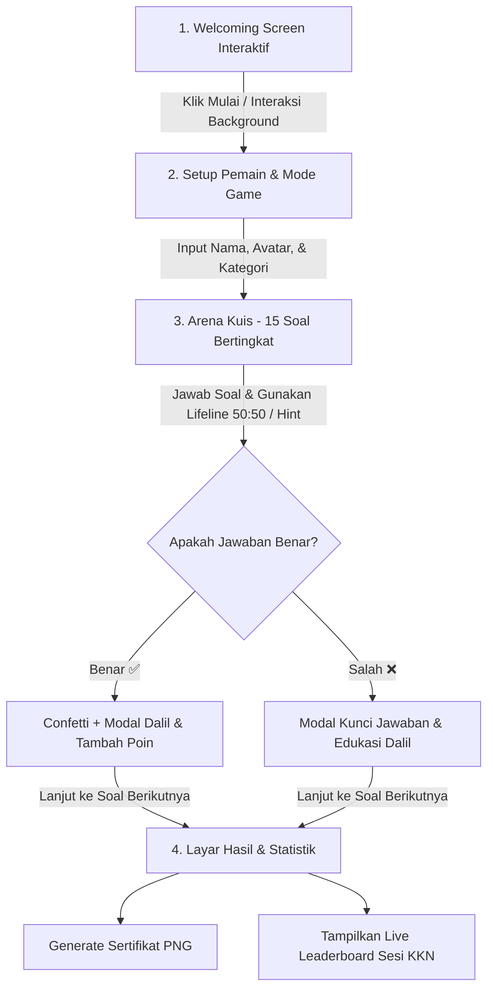
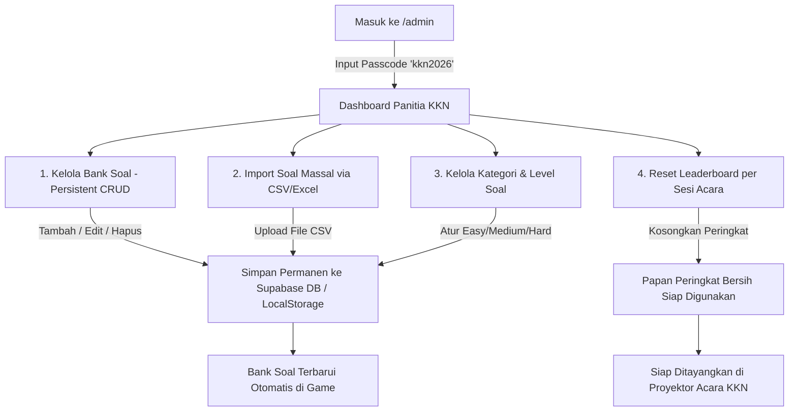

# 📝 Catatan Evaluasi & Rekomendasi Alur (Islamic Millionaire Web App)

Berikut adalah tanggapan, saran perbaikan UI/UX interaktif, serta alur (flow) terbaik untuk eksekusi game kuis **Islamic Millionaire** dalam kegiatan KKN:

---

## 1. 🎨 Solusi UI "Mulai Bermain" & Background Interaktif

### **Masalah Saat Ini**:
Background halaman awal masih berupa gradien statis navy gelap dengan bulatan blur biasa, sehingga terasa kaku dan kurang mengundang interaksi pemain.

### **Rekomendasi Peningkatan UI Interaktif**:
1. **Interactive Canvas Particles (Bintang & Lentera Islami)**:
   - Membuat efek bintang gemerlap (*twinkling stars*) dan lentera Ramadhan melayang di latar belakang.
   - **Fitur Interaktif Mouse**: Ketika kursor mouse digerakkan, bintang-bintang akan mengikuti gerakan mouse (*parallax cursor trail*) atau meletupkan percikan cahaya (*sparkles*) ketika di-klik.
2. **Interactive 3D Card Tilt Effect**:
   - Kartu utama *"ISLAMIC MILLIONAIRE"* menggunakan efek kemiringan 3D (*tilt effect*) yang miring mengikuti posisi kursor mouse pemain secara real-time.
3. **Interactive Widget "Kata Hikmah Hari Ini"**:
   - Menambahkan widget ucapan Islami / hadits singkat yang bisa di-klik pemain untuk berganti kalimat (*"Klik untuk Kata Hikmah Baru 🎲"*).
4. **Interactive Audio Control & Ambient Sound**:
   - Menambahkan animasi gelombang suara (*audio visualizer bar*) pada tombol sound agar pemain tahu musik sedang aktif dan bisa mengubah suasana audio.

---

## 2. 🛠️ Mekanisme CRUD Soal, Kategori, & Level untuk Panitia KKN

Agar aplikasi dapat dikelola secara mandiri oleh panitia KKN saat ini maupun angkatan KKN berikutnya, berikut adalah rancangan alur CRUD pada **Admin Dashboard (`/admin`)**:

### **A. CRUD Soal (Manajemen Bank Soal)**:
* **Tambah Soal**: Form interaktif dengan input:
  - Teks Pertanyaan
  - 4 Opsi Jawaban (A, B, C, D) & Penentuan Kunci Jawaban
  - Pemilihan Kategori & Tingkat Kesulitan (Easy, Medium, Hard)
  - Penjelasan Edukatif & Dalil Rujukan (HR / Ayat Al-Qur'an)
  - Petunjuk Ustadz Hint
* **Edit & Hapus Soal**: Tabel interaktif dengan tombol edit modal & tombol hapus.
* **Fitur Import Massal (Excel / CSV)**:
  - Panitia KKN dapat menyiapkan soal di **Google Sheets / Excel** dengan format template yang disediakan, lalu mengunggah berkas CSV untuk memasukkan puluhan soal sekaligus secara otomatis!

### **B. CRUD Kategori Soal**:
* Panitia dapat membuat kategori baru (misal: *"Sirah Nabawiyah"*, *"Sejarah Islam"*, *"Tajwid"*).
* Mengubah nama kategori, deskripsi, dan ikon emoji yang ditampilkan di menu setup pemain.

### **C. Pengaturan Level & Tingkat Kesulitan Soal**:
* Setiap soal diberi label kesulitan:
  - 🟢 **Easy** (Mudah): Untuk anak SD / pertanyaan dasar.
  - 🟡 **Medium** (Sedang): Untuk SMP-SMA / pertanyaan umum.
  - 🔴 **Hard** (Sulit): Untuk Mahasiswa-Orang Tua / pertanyaan detail.
* **Sistem Auto-Level pada Game**: Game Classic Millionaire akan otomatis menyusun 15 soal dengan graduasi tingkat kesulitan (Soal 1–5: Easy, Soal 6–10: Medium, Soal 11–15: Hard).

---

## 3. 💡 Saran Alur Permainan (User Flow) Terbaik untuk Kegiatan KKN

Untuk memaksimalkan daya tarik (*engagement*) saat acara sosialisasi KKN, berikut adalah alur permainan ideal dari awal hingga akhir:

---

## 4. 🔑 Panitia / Admin Flow (Alur Pengelolaan & Persistensi Soal)

Berikut adalah diagram alur khusus Panitia KKN (*Admin Flow*) untuk mengelola soal, kategori, dan persiapan sesi acara sosialisasi:

### **Detail Alur Kerja Panitia KKN**:

1. **Autentikasi Panitia**:
   - Panitia membuka URL `/admin` dan memasukkan passcode `ceritawedomartani`.
2. **Pengeditan Soal Secara Permanen (Persistent Storage)**:
   - **Masalah Sebelum Perbaikan**: Pengeditan soal di layar admin sebelumnya belum tersimpan ke media penyimpanan permanen (LocalStorage / Supabase DB), sehingga saat halaman di-refresh, perubahan kembali ke awal.
   - **Solusi Alur Baru**: Setiap kali Panitia menambah, mengedit, atau menghapus soal, sistem akan langsung mengeksekusi `GameService.saveQuestions()` yang memperbarui data secara permanen di database Supabase maupun `localStorage` browser.
3. **Impor Soal Massal via CSV/Excel**:
   - Panitia tidak perlu mengetik soal satu per satu. Cukup buat file Excel/CSV dengan kolom: `question_text`, `option_a`, `option_b`, `option_c`, `option_d`, `correct_option`, `category_name`, `difficulty`, `explanation`, `dalil`, `ustadz_hint`, lalu klik tombol **Upload CSV**.
4. **Persiapan Acara Sosialisasi (Event Mode)**:
   - Sebelum acara dimulai, Panitia menekan tombol **"Reset Leaderboard"** agar skor peserta dari sesi/hari sebelumnya dikosongkan.
   - Saat acara berlangsung, Panitia dapat membuka layar Leaderboard di proyektor untuk menayangkan skor peserta secara live!