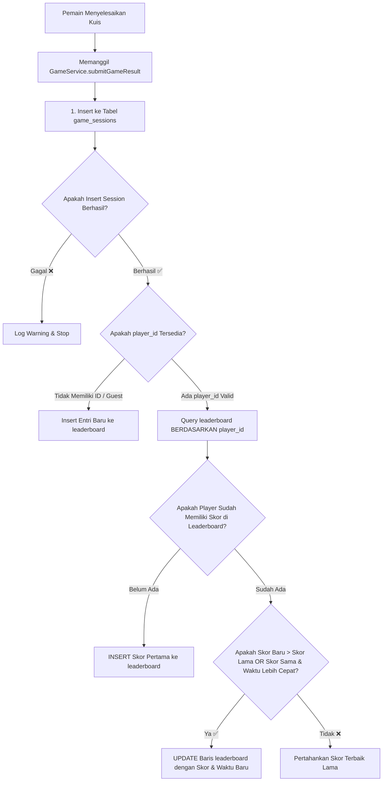

---

## 1. 🏆 Dokumentasi Lengkap Sistem Leaderboard

Dokumentasi ini menjelaskan secara menyeluruh arsitektur, skema database, alur logika backend/frontend, serta fitur UI/UX dari sistem **Papan Peringkat (Leaderboard)** pada aplikasi *Islamic Millionaire*.

---

### **A. Konsep Utama & Aturan Bisnis (Core Business Rules)**

1. **Satu Skor Terbaik Per Akun (Single Best Score per Player)**:
   - Setiap pemain (`player_id`) hanya memiliki **maksimal 1 baris entri** di tabel `leaderboard`.
   - Jika pemain bermain kuis berkali-kali, sistem tidak akan menambahkan baris baru, melainkan hanya memperbarui (*UPDATE*) baris yang ada apabila perolehan skor baru **lebih tinggi** dibanding skor terbaik sebelumnya (atau jumlah detik pengerjaan **lebih cepat** pada skor yang sama).
2. **Data Cloud Real-time 100% (Supabase Integration)**:
   - Papan peringkat sepenuhnya tersimpan dan diambil langsung dari cloud database Supabase.
   - Data tiruan (*dummy mock data*) seperti *Ahmad, Dinda, Fajar* serta cache fallback lokal telah dihapus total. Jika belum ada skor tercatat di database, sistem menampilkan pesan *empty state* yang interaktif.
3. **Propagasi Otomatis Perubahan Profil (Auto Profile Propagation)**:
   - Ketika pemain mengubah Nama, Avatar, atau Bingkai Profil (PNG Border Frame) di menu Profil, sistem secara otomatis mengeksekusi *UPDATE query* ke tabel `leaderboard` & `game_sessions` berdasarkan `player_id`. Dengan demikian, nama dan tampilan lama pada leaderboard langsung tergantikan dengan data yang paling mutakhir.
4. **Sorotan Pemain Aktif & Peringkat Personal**:
   - Pemain yang sedang login akan diberikan penanda visual `(Anda)` pada barisnya di tabel peringkat.
   - Apabila pemain tidak masuk dalam daftar Top 20 teratas, kartu khusus di bagian bawah modal leaderboard (*Statistik Terbaik Anda*) akan menampilkan peringkat eksak dan skor terbaik milik pemain tersebut.

---

### **B. Struktur Skema Database (Database Schema & RLS)**

Sistem leaderboard bergantung pada dua tabel utama di PostgreSQL Supabase: `public.game_sessions` dan `public.leaderboard`.

#### **1. Tabel `public.leaderboard`**
Tabel ini menyimpan 1 entri skor terbaik untuk tiap pemain yang terdaftar.

| Nama Kolom | Tipe Data | Keterangan / Constraint |
| :--- | :--- | :--- |
| `id` | `UUID` | Primary Key (Default: `uuid_generate_v4()`) |
| `player_id` | `UUID` | Foreign Key ke `players(id)` ON DELETE CASCADE, **`UNIQUE`** |
| `session_id` | `UUID` | Foreign Key ke `game_sessions(id)` ON DELETE CASCADE |
| `player_name` | `VARCHAR(100)` | Nama pemain saat mencetak skor terbaik |
| `player_avatar` | `VARCHAR(255)` | Path gambar PNG avatar pemain |
| `score` | `INT` | Perolehan Poin Amal tertinggi |
| `correct_count` | `INT` | Jumlah soal yang dijawab benar |
| `duration_seconds` | `INT` | Total durasi waktu pengerjaan kuis (dalam detik) |
| `event_tag` | `VARCHAR(100)` | Label acara (Default: `'General Sesi KKN'`) |
| `created_at` | `TIMESTAMPTZ` | Waktu pencatatan skor terbaik |

#### **2. Kebijakan Keamanan RLS (Row Level Security Policies)**
Untuk memastikan data dapat dibaca dan dikirim tanpa terhalang RLS (Row Level Security), aturan kebijakan berikut diterapkan pada tabel `leaderboard` & `game_sessions`:

```sql
-- Aktifkan RLS
ALTER TABLE public.game_sessions ENABLE ROW LEVEL SECURITY;
ALTER TABLE public.leaderboard ENABLE ROW LEVEL SECURITY;

-- Policies untuk public (Anon & Authenticated)
CREATE POLICY "Allow public read game_sessions" ON public.game_sessions FOR SELECT USING (true);
CREATE POLICY "Allow public insert game_sessions" ON public.game_sessions FOR INSERT WITH CHECK (true);
CREATE POLICY "Allow public update game_sessions" ON public.game_sessions FOR UPDATE USING (true) WITH CHECK (true);

CREATE POLICY "Allow public read leaderboard" ON public.leaderboard FOR SELECT USING (true);
CREATE POLICY "Allow public insert leaderboard" ON public.leaderboard FOR INSERT WITH CHECK (true);
CREATE POLICY "Allow public update leaderboard" ON public.leaderboard FOR UPDATE USING (true) WITH CHECK (true);
```

---

### **C. Alur Logika Pembaruan Skor (Backend / Service Logic)**

Mekanisme submit skor dikelola oleh `GameService.submitGameResult()` pada berkas `src/lib/gameService.ts`.



#### **Kode Implementasi Penyeleksian Skor Terbaik (`src/lib/gameService.ts`)**:
```typescript
if (result.player_id) {
  // 1. Cek apakah pemain sudah memiliki entri di leaderboard
  const { data: existing, error: fetchErr } = await supabase
    .from('leaderboard')
    .select('*')
    .eq('player_id', result.player_id)
    .maybeSingle();

  if (!fetchErr) {
    if (!existing) {
      // Belum ada -> Masukkan entri pertama
      await supabase.from('leaderboard').insert([{
        player_id: result.player_id,
        session_id: sessionData.id,
        player_name: result.player_name,
        player_avatar: result.player_avatar,
        score: result.total_score,
        correct_count: result.correct_answers,
        duration_seconds: result.duration_seconds,
        event_tag: result.event_tag,
      }]);
    } else if (
      result.total_score > existing.score ||
      (result.total_score === existing.score && result.duration_seconds < existing.duration_seconds)
    ) {
      // Ada & skor baru lebih baik -> UPDATE skor terbaik
      await supabase.from('leaderboard')
        .update({
          session_id: sessionData.id,
          player_name: result.player_name,
          player_avatar: result.player_avatar,
          score: result.total_score,
          correct_count: result.correct_answers,
          duration_seconds: result.duration_seconds,
          event_tag: result.event_tag,
          created_at: new Date().toISOString(),
        })
        .eq('player_id', result.player_id);
    }
  }
}
```

---

### **D. Fitur Tampilan UI Component (`LeaderboardView.tsx`)**

Komponen UI leaderboard terletak pada berkas `src/components/LeaderboardView.tsx`. Berada di dalam modal pop-up dengan estetika Islami bernuansa emas dan mika transparan (*glassmorphism*).

#### **Fitur-fitur Utama Layar Leaderboard**:
1. **Lencana Juara (Rank Medals)**:
   - 🥇 Peringkat 1: Gradien Emas Berkilau (`from-[#FEF3C7] to-[#F59E0B]`)
   - 🥈 Peringkat 2: Gradien Perak Modern (`from-slate-100 to-slate-300`)
   - 🥉 Peringkat 3: Gradien Perunggu Warm (`from-amber-100 to-amber-200`)
2. **Frame Avatar PNG Dynamic Overlay**:
   - Menampilkan avatar karakter pemain beserta bingkai *border frame* PNG kustom yang dipilih pemain pada profilnya.
3. **Kartu Peringkat Saya (Personal Best Stats Card)**:
   - Terletak di bagian paling bawah modal leaderboard.
   - Menampilkan peringkat eksak pemain aktif (`#1`, `#5`, dll.), skor Poin Amal tertinggi, jumlah jawaban benar, dan durasi detik pengerjaan.
   - Diperoleh dari fungsi `GameService.getUserBestStats(playerId)` yang menghitung peringkat secara dinamis berdasarkan jumlah pemain dengan skor yang lebih tinggi (`gt('score', userScore)`).
4. **Tombol Refresh Real-time**:
   - Memungkinkan pemain atau panitia me-refresh data leaderboard di tempat tanpa perlu memuat ulang (*reload*) seluruh halaman aplikasi.

---

### **E. Pengelolaan Admin & Pembersihan Data (Admin Operations)**

1. **Reset Leaderboard per Sesi Acara**:
   - Pada panel Admin (`/admin`), panitia KKN dapat menekan tombol **Reset Leaderboard**.
   - Fungsi `GameService.resetLeaderboard()` akan menghapus seluruh isi tabel `leaderboard` di Supabase sehingga papan peringkat bersih dan siap digunakan untuk sesi acara kuis baru.
2. **Pembersihan Manual via SQL**:
   - Jika panitia ingin mengosongkan riwayat kuis dan leaderboard secara total via SQL Editor Supabase:
     ```sql
     TRUNCATE TABLE public.leaderboard CASCADE;
     TRUNCATE TABLE public.game_sessions CASCADE;
     ```